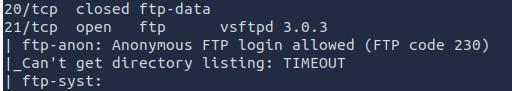
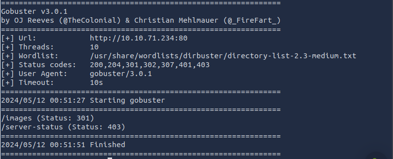
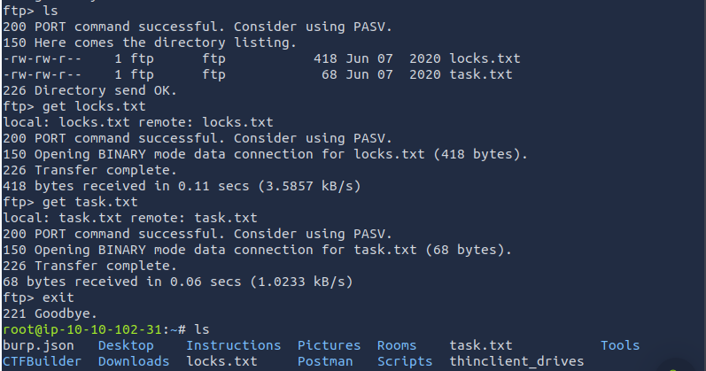
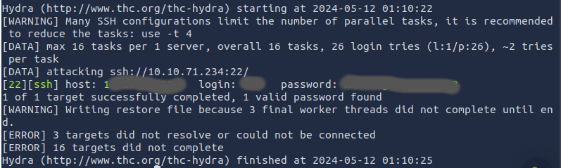
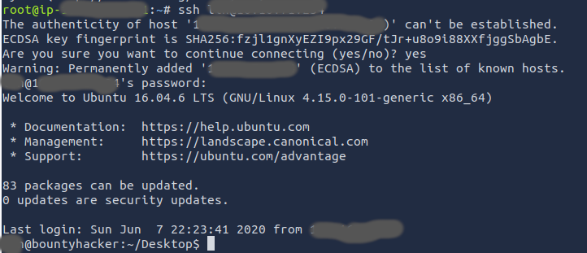
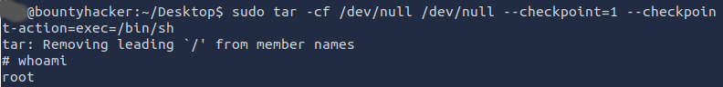
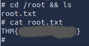

One of the first CTF rooms I completed without any external help on [TryHackMe](https://tryhackme.com/) is the [Bounty Hacker Room](https://tryhackme.com/r/room/cowboyhacker). As with any engagement, having a structured plan of attack is important, and getting in the habit of it early is something I made sure to do. Depending on who you ask, there are variations on the themes, but I've come to develop a six step methodology that is based on the culmination of the various books and lessons I've been exposed to. Initial recon, scanning and enumeration, exploitation, escalation, exfiltration, and reporting. Something worth noting, though, is that this is not necessarily a linear process. There have been numerous times when I went to use an exploit, and was unable to progress, and had to backtrack a little bit, or needed to do more scanning and enumeration after a successful exploit. Below describes the steps I took to complete the CTF. 

Recon:
1. For something like a CTF, especially on [TryHackMe](https://tryhackme.com/), the recon step tends to be a bit underwhelming. We already know our target, an internal IP address on [TryHackMe's](https://tryhackme.com/) network. Whois, OSINT, DNS lookups, and all that won't help us much here, so it's time to move on to the next step.  

Scanning and Enumeration:

2. With our target in our sights, the next step is to learn more about the target. Nmap, in its ubiquity, is my preferred port scanning tool, despite its tendency to be quite loud by default. The command I used is "sudo nmap IP_ADDR -p 1-1000 -sV -sC v". Generally, CTFs tend not to have ports open beyond the first 1000, but if I don't see anything interesting on the first pass, I'll expand the port range. -sV is always good for getting more information out of a target, and -sC can similarly reveal pretty good information with little effort. -v is mostly just a preference. I like the user feedback. This machine appears to have three open ports; 21, 22, and 80. Nmap identifes port 21 as running an FTP server, which is pretty standard for that port, port 22 as SSH, which is, again, standard, and port 80 running an HTTP service. One of the vulnerabilities nmap has identified is that the FTP server allows anonymous logins, which is not a bad thing to try, anyway, but now we know that this should let us in without needing a full set of credentials, and will be worth exploring.   

3. While nmap is running, I like to check on port 80. This is more of a habit formed by doing CTFs, but it's usually somewhat enlightening, and leads to a second method of enumerating a target. In this case, the page at the IP on port 80 just looks like it's flavor text, but there's still more we can do here. I favor GoBuster when I need to enumerate a website. Generally, I'll open up another terminal tab, and run GoBuster while I'm running nmap, to speed things along. The boxes on [TryHackMe](https://tryhackme.com/) have a solid set of wordlists, and for GoBuster, I tend to use the wordlist at /usr/share/wordlists/dirbuster/directory-list-2.3-medium.txt, but you can use any list you'd like. The command for this step that I ran was "gobuster dir --url=IP_ADDR:80 --wordlist=/usr/share/wordlists/dirbuster/directory-list-2.3-medium.txt". There are other options we can add in if we want to find more pages, but this usually gives a pretty good idea of what we're dealing with, at a glance. After gobuster completed executing, it didn't look like there was anything noteworthy. Which means it's time to check our FTP server. 

Exploitation:

4. An anonymous FTP login really doesn't feel like a big bad exploit, but a misconfiguration like this can be bad when there are important files on a server. Upon logging into the FTP server, a quick "ls" reveals two files; locks.txt and task.txt. I called "get" on both files, and then exited the server. Back on my attacker machine, I called "cat" on both of the files to see what kind of info they had. locks.txt was filled with a number of various 1337 sp34k variations of some themed names / phrases / words. My first instinct is that it might be worth using as a wordlist, and right now, we only have the SSH port, but no username. task.txt has two names that might be worth trying a login for. So now we have something to try.

5. Armed with two usernames and a potential password list, I next turned to Hydra, one of the "brute-forcing" (technically, in this use case, a dictionary attack) tools I am familiar with. The first username I figured I'd try was the author of the task.txt file. The CTF kind of nudged me in that direction, so why go against the flow? The command I used here was "hydra -l USERNAME -P locks.txt ssh://IP_ADDR:22/". As shown below, Hydra found a valid username/password combo using that list. 

6. With a valid combination, the only thing left to do is to try connecting to the SSH port using the credentials we've discovered. Using the "ssh" command with our username and password, and a first-time connection, I'm in... (sorry, I had to). 

Recon and Exfiltration:

7. Having successfully breached the machine, some initial recon helps us get our bearings. "ls" reveals a file that the CTF is looking for in the directory SSH put us into. A quick "cat" reveals the flag, but there's one more that we need to find that, based on its name, is probably owned by root. Going up two directories reveals that we are the only other human user on this machine, meaning it's time to escalate privilege, and see if we can find our file in the root directory. 

Escalation:

8. My first go-to for privilege escalation is to look for SUID files. [GTFOBins](https://gtfobins.github.io) is a fantastic resource that I use for this step. After running the command "find / -type f -perm -04000 -ls 2>/dev/null", I search through the page on [GTFOBins](https://gtfobins.github.io) to see if any of the results I got can be exploited on the local machine. Sudo shows up on the list that we can try, and we have our user's password, but after running "sudo ls" we learn that sudo is restricted. "sudo -l" will show us exactly what we can run, and it looks like it's just /bin/tar. Maybe we can work with this. There is a page for tar on [GTFOBins](https://gtfobins.github.io), with a method for accessing a shell, and I can run tar with sudo. Worth a shot. 

Recon and Exfiltration:

9. Now that I am root, let's check to see if our root.txt file is where we think it is. A quick "cd /root && ls" reveals that root.txt is, in fact, here. Calling "cat root.txt" reveals the final flag, and a successful completion of this CTF.

Reporting:

10. Finally, having completed the CTF, and gained root access, the only thing left to do was to write up my findings, which leads us to this document. If this were an engagement for a client, this would be where we recommend fixes based on our exploits. So, one fix, is to disable anonymous FTP. Without this misconfiguration, I would have never found a username or password. Alternatively, use something other than FTP. We have an SSH service running, so SFTP might be a good alternative. In addition, don't allow users to store files with passwords on the machine. This could exist as an administrative control, or could be implemented as a technical control if there are resources available to scan files for content, and compare them to the users' passwords. A second change that might be worth implementing is to use SSH keys instead of password-based authentication. The password used was relatively strong. It is over 12 characters, and contains a mixture of upper and lowercase letters, as well as numbers, and is unlikely to be breached by the average machine attempting a pure brute-force attack. That being said, adding special characters to the password can help strengthen it against any true brute-force attempts. Alternatively, or in conjunction, an IDS/IPS may have been able to identify my dictionary attack on the SSH port, and could have blocked my IP address. With respect to the privilege escalation I used, the administrator will want to evaluate if sudo is necessary for tar. I would recommend implementing logging in conjunction with a SIEM, as well. This will allow visibility at all steps in the process. 
