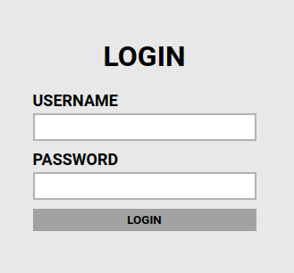

This was a CTF I completed one afternoon after a different CTF event that didn't go as well as I'd hoped. I was a little discouraged by my performance, so I decided to show myself that I'd "still got it". I decided to go for something on the easier side that would give me some good practice, and I settled on [Brute It](https://tryhackme.com/r/room/bruteit). This CTF was mainly focused on brute-force techniques, and while this should have been pretty straightforward, this room ended up motivating me to add more variety to my brute force toolbox. 

1. Before starting any attacks, we needed to perform recon on the VM that came with this room. While I tend to like to break up my nmap scans to decide what kind of flags to use as I move forward, the one, single nmap command that can be used to replicate each of those steps and get most of the flags for the recon stage is "sudo nmap -sV -sC IP_ADDR". This nets four flags for this room.

2. Continuing on with the recon stage, we are told that one of the flags is a directory on the web server. While the path is something that's probably a given to try manually, if you're so inclined, I used GoBuster to speed that process along. My preferred wordlist is the medium list, as I find it doesn't take too much more time to find interesting endpoints, and is robust enough to find what we need on THM. We found the endpoint we needed to fairly quickly, and I ended execution of GoBuster early. 

3. Naturally, and endpoint like this deserves investigation in the form of active recon. Unsurprisingly, given the room, this page is a login form. So, first thing's first, I'm going to try some sort of default login like admin:password, just to see what happens. This did not work, so now we have to see what else we can do. However, one thing to note is that the webpage is now displaying a different message, "Username or password invalid". Since I'm planning on using Hydra, I'll want to keep this in mind for later.
   
   
   

4. Now, I've seen a few walkthroughs that will recommend Burp for this next part, and that's fine, but it's possible to figure out which parts of the page to target without Burp, and I feel like if you're going to use Burp to intercept the request, you might as well use it to finish the job with the repeater module. And my preferred method reveals the username. Since I'd been planning on using Hydra, I did it the old fashioned way, and right-clicked View Page Source. We're looking for a form element in the HTML. Being a simple page, this is easy to find. This form element will tell us which REST method we're targeting, as well as what our inputs are called. While, yes, we're going to be sending a username and password, they may not be called that in the HTML, and if you assume that, you may spend a lot of time targeting nothing. In this case, the username input is called "user" and the password input is called "pass". Conveniently, the username is also on this page in a comment. Looks like I'm not a bad guesser. With this, we have everything we need to target the webpage. Allegedly. 

5. Armed with the target endpoint, the form inputs, and the failed login error, we should be ready to launch a brute force attack on the endpoint (assuming you've already got a wordlist). I used Hydra for this CTF. When using Hydra, there are a few important optional flags that I like to use. -v will show us which passwords we're trying, and gives user feedback that it is still running. -f should stop Hydra when it reaches the correct password. -t INT will limit Hyrda to use only INT number of threads as it runs. Sometimes, you can adjust this number down when you encounter false positives, which we will be addressing shortly. Required flags are -l or -L for a username or the path to a list of usernames, while -p and -P function the same but for passwords and paths to password lists. The target must also be included as an argument, as well as what method / protocol you're using to attack. Different methods / protocols will require different syntaxes. Our command will look like this:

6. Now, if you're here looking for an easy win on the CTF, sorry. This is where I ran into issues and I'm going to take the time to explain all of that before I talk more about the CTF. Hydra as a common issue where it will display false positives as correct passwords, and this is what I ran into here. Normally, the fix I've always used is to adjust the -t value to something smaller. Most people will suggest -t 4. Unfortunately, that doesn't work here, instead revealing four false positives quite happily.
   

   Now, adjusting the flags here made sense to me, so I tried that, playing with -f and -v to see if that would change the output, without success. The error was somewhere in the http-post-form and its follow-up string argument. http-post-form's follow-up argument is broken down into three parts; the resource path, the URL arguments, and the error message for a failed logon attempt. A colon separates each section. Looking at the command, we can see that the failure message matches the message we saw in step 3. While it doesn't need to be an exact match, it's not a bad idea to make it match as closely and consistently as possible. So this part looks good. The middle portion, the URL arguments, were informed by step 4. Hydra inputs its username(s) at ^USER^ and its password(s) at ^PASS^, and as long as the argument name matches the input name, it should be fine. Which leaves the path. Now, as someone who fumbled here, I would completely understand if "/admin" looked correct. That was what GoBuster seemed to tell us was the endpoint. However, this is not the case. If we look at the URL in a browser, we see that there is a trailing '/' after the endpoint, and this matters to Hydra. In fact, it's where Hydra is redirected to when it provided its false positives, something I did not notice at the time. Which was very frustrating, I have to admit. In one of the walkthroughs I looked up to see what others did, I noticed someone used "/admin/index.php" which worked, too. Looking into why is a story for another time, but I learned something about the index.php page out of this hiccup, and noticed the '/' while writing this walkthrough. Hydra is a very sensitive tool. By the end, the command and output looked like this:

7. Armed with the credentials, I was able to log in, and access the first "flag-flag" that the CTF refers to as the "Web flag". On this page, there was also link to download an RSA key, which is used to access SSH servers without the need for a password. Lucky for us, this key is password protected. First, we need to copy the RSA file to our attacking machine. Copy the entire contents of the file locally, including the BEGIN RSA PRIVATE KEY line, all the way to the bottom END RSA PRIVATE KEY line. To be able to crack this file, I'm using John the Ripper, but first, we need to convert the RSA key to a format that John can handle. For this, we need to use ssh2john. Because this is not my system, I need to locate the module by changing directories to "/" and running "locate ssh2john". I found it in /opt/john/. Because I named my file key.rsa, the syntax for the command is "/opt/john/ssh2john.py key.rsa > OUTFILE". It's important that we send the output from this program to an output file so that we can send it to John proper. Which is the next command, "john --wordlist=/usr/share/wordlist/rockyou.txt OUTFILE" reveals the key.rsa's passphrase. 

8. Before we use the key file to login, we need to make sure it has the proper permissions, otherwise SSH will give us issues. Run "sudo chmod 600" to give the file the proper permissions, and then login to the machine using "ssh -i key.rsa USER@IPADDR". The key file is password protected, so when prompted, we need to enter the passphrase from the previous step. The CTF prompts us to find a flag called user.txt, which is found in the user's home directory, and can be extracted with a simple "cat user.txt" command. 

9. From here, we need to perform privilege escalation to figure out the root password, and the root flag to complete the CTF. One of the first things I'll often do is run "sudo -l" to see what the user we're logged into can run as root. In this case, "/bin/cat" is one of them, which can be very useful for a number of reasons. The first of which is, if you know where to look, you can find some interesting files. Having done a few CTFs, I know that the "/root" directory is often where the root.txt file is, and, well, I was right. 

10. Now, to get the root password, I decided to crack the hash in the shadow file using John the Ripper. I did this by running "sudo /bin/cat /etc/passwd" and "sudo /bin/cat /etc/shadow" and copying the lines for root into their own, local files, before running the unshadow command, "unshadow passwd.txt shadow.txt output.txt". While not strictly necessary, I'm not huge on parsing Linux password hashes, and this puts it into the format John wants it in. Unfortunately, the VM on TryHackMe was not executing in a timely manner, so I copied the unshadowed file over to my machine and ran the following command (You may notice I use the "--show" flag here. With John, if you've already cracked a hash, you'll need to use this to show the password.):
    
    

And with that, Brute It is complete. Even with a simple CTF like this, I was able to learn more about the tools I use, and show to myself that I can be adaptable when the first try doesn't work out. On top of that, it inspired me to work on another room, [Brute Force Heroes](https://tryhackme.com/r/room/bruteforceheroes), which is more of a guided lesson than a CTF. Hydra has proven to be very testy, but I've already seen from Brute Force Heroes a few reasons why it's good to have multiple tools for the same task. I've been busy catching up on some of the newly released modules for paths I've completed, as well as some newly released modules that directly relate to my current duties as a security awareness trainer, so once I work my way through that backlog, I plan on trying my hand at another CTF on TryHackMe. 
