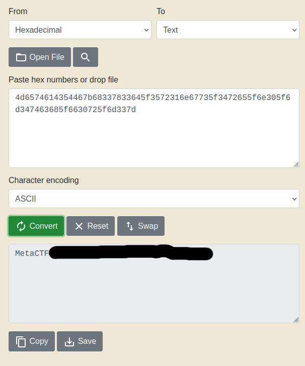

I'm a little late with October's walkthrogh -- writing it after November's CTF (which should go up shortly after this one)(And I'm also finishing it in December...). You'd think I would have been more eager to post this one, but in my defense, the last few weeks of October into November were busy, and stressful. The beginning of this CTF was a little problematic; the website was unreachable for the first fifteen minutes of the challenge, for me, at least. Regardless, or maybe because of this, I scored 25th of 1045, 333 scoring. This is the best I've placed in this, or any CTF, and I'm excited to see my growth. Especially since September's CTF went the way it did. I only got three of the five challenges, but the second hardest only had 8 teams solve, and the last one had none. Also keep in mind, I've been doing these alone. I happened to notice, too, that my university fielded a team for October, which was neat to see. I did not see them in November, so maybe I should reach out, since I'm close enough to the school. Despite my relatively inexperienced journey, I think it could be a good way to reach out to new talent, and offer what mentorship I could provide. Rambling aside, let's get into the challenges. I'm turning into those recipes that tell their whole life's story before what you really come for haha. 

1. The first challenge is reminiscent of a social engineering campaign that had been making the rounds a bit before October. This was something I had actually come across from one of my team members at my job. I ended up making a [simulated phishing campaign](https://github.com/PhoenixBoisnier/CTF-Walkthroughs/blob/main/MetaCTF-17-10-2024-Walkthrough/my-phish.png) to test my organization with in my role as Security Awareness Trainer / Phishing Administrator. The idea is that you're presented with a realistic-enough captcha page, where after you click the button, a PowerShell command is copied to your clipboard, and you're instructed to do Windows + R to get the run dialog to pop up, and paste the code into the text field, and hit enter. I'm proud to say that the vast majority of users in my organization didn't fall for it. You're never going to get 100% without spoon-feeding, the point is to make your users aware enough to alert the security team to block and / or remove the threat from the environement. In any case, the link on MetaCTF brings us to a page like this:

	

	Knowing what to expect, I clicked the button. 
	
	
	
    Being fast and lazy, I just executed the PowerShell code, but returned an error, so I has to look at it a bit more closely. I was unfamiliar with the -eC flag, but after a quick search, it looks like it tells PowerShell to execute an encoded command. Since the following string was base64 encoded, sending that over to [base64decode](https://www.base64decode.org/) we see that every-other character is meaningful text, and you can visually parse out the MetaCTF flag. 

2. The next challenege is a reverse engineering challenge, so I booted up Ghidra. While I waited, I called "chmod +x tomb" on the challenge file, tomb, and playd around a little. 

	

    It looks like this challenge was going to be looking for a password of some sort. One of these days, I'll remember to use the strings command, but instead, I started paging through the functions that Ghidra was showing. The main function has a while(true) loop that is running a strcmp() function on what appears to be a hexadecimal string. 

	

    So between the loop that keeps the program running, and the function comparing strings on an obsfucated value, I figured I should try to convert it from hexadecimal to ASCII so I can read it. I tend to use [RapidTables](https://www.rapidtables.com/convert/number/hex-to-ascii.html)'s hex to ASCII converter, but another popular option is [CyberChef](https://cyberchef.org/). Lo and behold, the converted value is in the same format that MetaCTF does its flags. 
	
	

3. The third challenge was a web-based challenge. The page is a form where you can upload files. This immediately seemed like a file upload challenge, so I began trying various filetypes to upload. The first was just a simple test file, test.txt. By doing so, this helps us scope out two things: whether or not the website accepts .txt files, and potentially where those files end up on the website. 

	

    Lucky for us, it accepts both .txt files, tells us where the files are uploaded, and we see on the upload confirmation page that the website uses PHP. 
	
	
	
	
    So the next thing to try is to upload a PHP script that we can control. First I tried a basic .php file, and was shown the upload failure page. 
	
		
	
    Which is fine, I figured the third challenge wouldn't be as easy as .php. So I tried .php3, .php4, and finally was able to upload a .phps file. However, upon visiting the .phps file page, the file I attempted to load on the page did not function as I had expected. My first upload attempted to execute "cat flag.txt", but showed only a blank page. Because file uploads aren't something I've excelled at in live-fire, or close enough scenarios, I ended up circling back to this one later. When I did end up back on this one, time was running short, so I tried a few other techniques, one of which being a directory traversal attack on the URL. At the time of the competition, this was a valid attack, and it worked. 
	
		
	
    When I went to do this writeup, as a sanity check, I actually reached out to the support email address MetaCTF has for these challenges (who've always been very nice to exchange communications with). Turns out that the flag had been somewhere it was not intended, and that my attack was no longer effective. As a result of me reaching out, the author ended up realizing there was a typo in the writeup that pointed to the old directory, and that was updated. 
	
    Because of this, I ended up trying it out the way it was intended, and learned a bit about htaccess files. The first few times, I gave the .htaccess file a name, thinking it was a type of unique file extension, based on the way I was reading the writeup. Turns out, it's more of a hidden file type . before the htaccess portion. That took me longer to realize than I'd have hoped, but I did eventually get it to work, and get the flag. This exploit takes advantage of using the .htaccess file to allow us to map custom file extensions, and the fact that the .htaccess file can be uploaded. By doing this, we can upload a PHP webshell with an arbitrary extension, so long as it's mapped in .htaccess, upload the .htaccess file, then the PHP webshell (or a PHP script that calls "cat flag.txt", but that's less versatile), and send commands from the website's server. 

4. This challenge was a binary exploitation, and I feel like I knew, roughly, what I had to do to solve this one. Or at least I did during the challenge. I had been recently playing with something I thought could be somewhat similar in the Huntress 2024 CTF, in honor of cybersecurity awareness month. I have a document for my experience with that, too, but I only placed 666th, and got maybe a third of the challenges. It was tough to stay competitive while having to work during the day. In any case, this was a buffer overflow exploit. I was able to figure out how much I needed to put into the input to get an error to pop out, but I couldn't quite make the leap from input to bypass the canary. Let alone figure out how to leak the dynamic memory address of the win() function. Seeing that this challenge's writeup has a script as part of its solution, I think I probably spun my wheels too long on the third challenge to have gotten this one, anyway. 

5. I didn't even try to touch this one. It was a crypto challenge, and I was getting close on the fourth challenge, and had no time. Seeing that nobody else completed it made me feel a little better about not getting to this one. Because as much as I do this for myself, I do want to build a career out of it, and the competition is steep, so I need to find ways to stand out. Which is part of why I do these writeups. But I also want to give back to the community, on the off chance that someone can be helped by these. Or if nothing else, show that it's not always "just that easy" like a lot of the media out there would have you believe. 

At any rate, I feel like this was a good performance on my part. This was the highest placement I've achieved so far, and it had one of the highest number of participants for a MetaCTF CTF I've participated in. Spoiler alert for next month's CTF (since I'm finishing the writeup in December, now), I did a little worse. But December's CTF is set to have 10 challenges, and take place for four hours. I'm excited for that, because I think it's going to provide a more steady / average performance metric I can measure myself by. Between the writeups I need to do, and TryHackMe's Advent of Cyber for this year, I'm hoping I can get all of the easy wins within enough time to let me work through the kinks in the tougher ones. Fingers crossed, anyway. 

