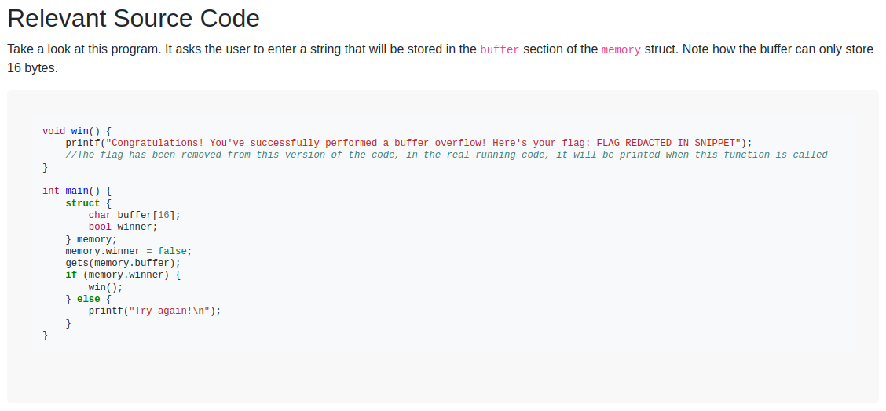
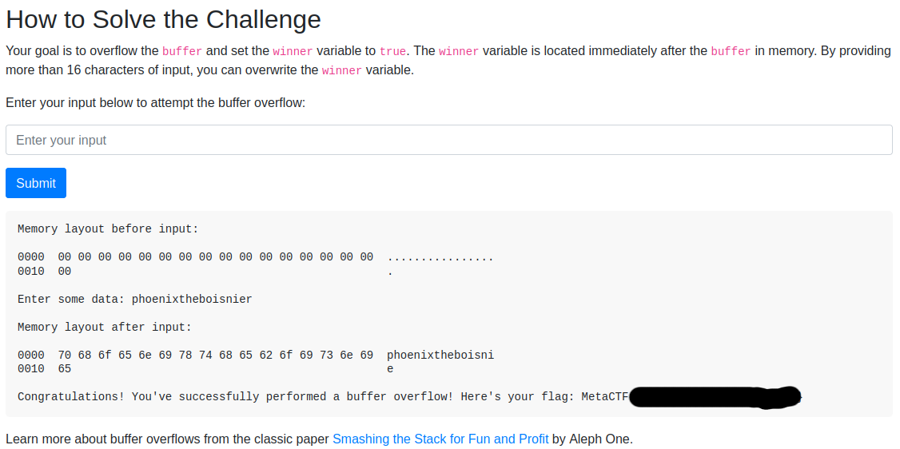
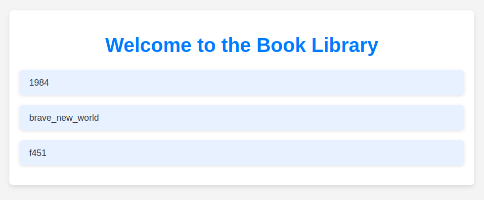
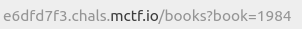
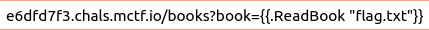

It's been a month, and I did well enough on the CTF this time around, so we're uploading another walkthrough. That being said, this month was a good reminder that progress isn't linear, and that there are a wide variety of exploits, techniques, and technology in the field of information security. One of the thing's I've been enjoying about MetaCTF's challenges is that I keep getting exposed to new information. And while, like for this month, I am noticing that my instincts seem to be sharpening, in timed scenarios, I'm still unable to find and ingest the information I need to be a top scorer. I was able to solve two of the five challenges. I knew what to target for the third challenge, and where the vulnerability was, but I was ultimately unable to execute. I was able to make some progress into the fifth challenge before the time ran out, and the fourth challenge was just a reminder that I need to get better at crypto. In any case, let's get into the details. 

1. The first challenge was, as its description stated, a simple introduction to binary exploitation. Specifically, buffer overflows. This challenge, quite literally, tells you how to solve it. But, for the curious, it's a very simple, and easy to follow explanation of what a buffer overflow is, and why it works. There's a character array of length 16, followed by a boolean value in our code. Since a boolean is true if it's anything other than '00', the code uses the 'gets' function, and the memory layout puts our boolean value right after the array, 17 characters input into the text box will get you the flag. Alternatively, something fun I noticed during the writeup is that you can perform the overflow using the URL parameter. 

2. The next challenge was a bit time consuming, the way I approached it. In this challenge, we were provided with the source code of a program that was running on a remote machine. Like most other MetaCTF challenges, the flag was not part of the code. [Maybe someday, it will be.](https://github.com/PhoenixBoisnier/CTF-Walkthroughs/blob/main/MetaCTF-22-08-2024-Walkthrough/code1.png) I started to go through the logic by hand, but it became clear to me that this was the challenge that MetaCTF expected us to write code for. And I'm not too keen on doing that in timed challenges for topics I'm not regularly programming on / in. So I tried to get Copilot to help write an algorithm to create keys. I keep finding that Copilot is a bit limited in this respect. This one would have been simple enough to do, but wrestling with Copilot was the more appealing choice, to me, apparently. After that didn't work, I took a peek at the third and fourth challenges while I built up the drive to go through the logic by hand before returning to the second challenge. To solve this one, I opened up a python shell in the terminal on my machine, and went condition by condition. When I was ready, I connected to the remote machine with the supplied command, input the key, and got the flag. Below is just the logic that defines the key. It's easier to look at each character's logic on each line, but python is whitespace sensitive, so be aware. You want it to return true, which means each condition needs to be negated. Don't forget DeMorgan's here if you're going to do this manually, since if any of these conditions fails (meaning if any "line" evaluates to true), we don't get the flag. 

       len(key) != 8 
    or ord(key[0]) % 5 != 3 
    or ord(key[1]) % 4 != 2 
    or not key[2].isdigit() 
    or not key[3].islower() 
    or not ord(key[4]) <= ord(key[3]) + 5 
    or not key[5].isdigit() or int(key[5]) <= int(key[2]) + 2 
    or not key[6].islower() or ord(key[6]) >= ord(key[3]) - 3 
    or not key[7].isupper() or ord(key[7]) >= ord(key[4]) - 4:

3. This challenge was a website exploitation challenge. While I did not end up solving this one, I did know where to attack. The website itself is very bare-bones. There's no real obvious inputs, and the source code of the page itself doesn't really show us anything worth targeting. Clicking around on the various books ends up revealing a URL parameter, which ends up being the part of the website that we need to target. Conveniently, this challenge comes with a source code download. Inconveniently, for me, it is in Go, and it turns out that I don't know how to inject using Go. The code was easy enough to read, and it confirmed that this was the part of the website we needed to target; the URL parameter was not sanitized, and was passed along to the function that ends up loading the information into the page. I was able to play around with the parameter, and get my URL input to display on the page, but I think that ended up being part of my downfall. I thought I could send the parameter flag, flag.txt, etc. But, because the backend was Go, it needed a goofy set of double curly braces, and I needed to reference the function. Or as the writeup calls it, the method (as do most other programming languages). I don't know that I've seen a language or website where I: had the source code, and could call functions in the source code from the website input. But now I have something interesting to look up on my preferred training website(s). 

4. This was the crypto challenge for this month's CTF. I really didn't touch this one very much. I tried to see if I could get the encryption key to pop out by giving it short input, or other input that could have revealed information about the key, but I was busy with the other challenges / busy testing the limits of Copilot, evidently.

5. I think I could have gotten a bit deeper into this one if I hadn't spent so much time herding cats for the second challenge. The final goal for this CTF was, given an email, answer questions on a remote server whose answers were determined by the forensic analysis of the email. I've done some forensics for my current job, and most of the time, that was with malware delivered via email, so despite focusing on this challenge with only five or so minutes to go, I thought I maybe had a sliver of a chance to get it. Which would have been pretty cool since nobody ended up getting this one, and I would have come in 4th (If nobody else scored in the meantime). The first question we get asked for this is who the sender of the email is. That's simple enough, it's given to us in the from header. The next question was to find the MD5 hash of the attached file. Me being me, I decided to do this the hard way by copy / pasting the whole Base64 string, and putting it into a [Base64-to-file tool online](https://base64.guru/converter/decode/file). I probably could have used [the go-to for Base64 encoding and decoding](https://www.base64decode.org/), and then pasted the result into a .iso file (because the email tells us it's an ISO file), which would have been similarly convoluted, when I could have just opened the email in an email client, and downloaded it like a normal person. ANYWAY, now that we had our file, it was as simple as running md5sum on the file in the terminal, which gave us the hash we were looking for. It was at this point that I was supposed to start looking for an XOR key to decrypt the payload and drop the temp file, but I ran out of time before I was able to. I've got a lot going on at the moment, between just Life Things™ and personal projects, but if I make time for it, this is a challenge I think I'd like to come back to finish. And then I can feel like I did better. 

All in all, I think the biggest reason I didn't place as well this time around is because I played around with Copilot too long. The very first question was actually given out to everyone, and the second one would have taken only a few minutes if I'd just faced it head on like I should have. That would have left me with plenty of time to get confused by Go's goofy syntax and probably still complete the fifth challenge. Sure, I wish I did better, but I'm finding satisfaction in knowing that a lot of what's going on here is familiar, and I know where to look. Eventually, I'll know what to do with what I find more and more until I can start placing in the single digits. In the meantime, I'll have to continue practicing, and see what the future brings. 
