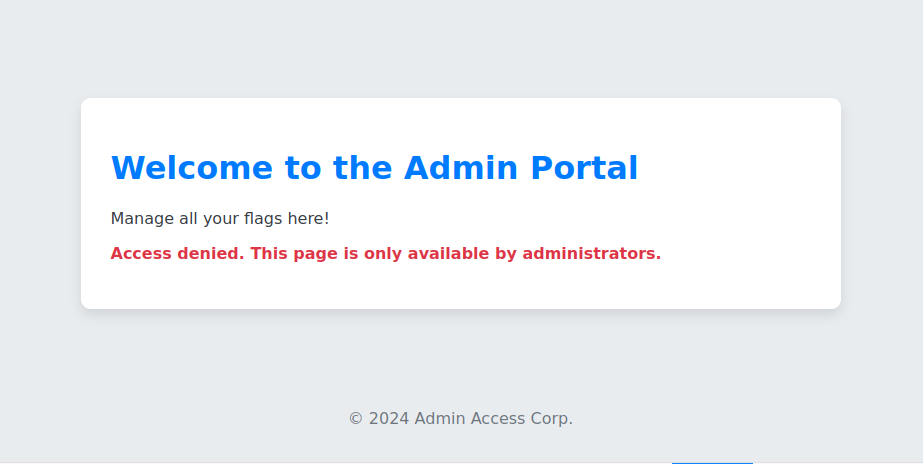
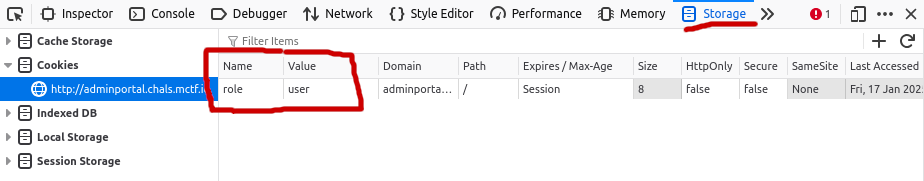
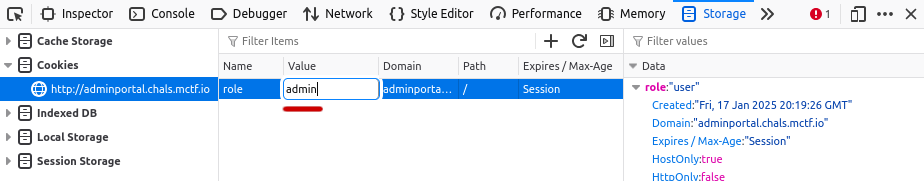
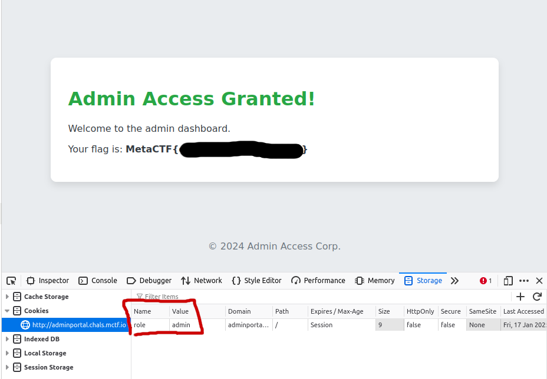

I'm late again. Holidays and personal projects don't mix well. I didn't do as well as October's, placing 63rd of 345 scoring folks, and 925 registered, and I solved one less problem. Granted, progress isn't linear, and I did decently during December's, I'm still not where I want to be. Eventually, I'd like to be able to submit a fully completed walkthrough. For now, I'll just have to be satisfied with progress. 

1. The first challenge is a pretty straightforward code analysis problem. We're given a very short program that contains the flag within it. Thankfully, it's a little more exciting than just being in plaintext, which ends up being the bulk of the challenge, here; recognizing or being able to figure out what kind of encoding the flag is in. There's also a password that's been hashed. Since there's no guarantee that we'll be able to figure out the password in time, and since the flag is given to us, our best option is to attempt to decode the flag. In python, values that take the form b'\x0f', while hexadecimal in nature, is a bytestring. Some online tools, such as the [Hex to Text Converter](https://www.rapidtables.com/convert/number/hex-to-ascii.html) on RapidTables, can handle this format elegantly, while others may not. I find that the most reliable method is to start the python shell, and call .decode() on your bytestring. In this case, the decoded string does not seem to have meaning to us, but it's ultimately just another layer of obfuscation. At this point, I can intuit that the given string is in base64, but the code we were given also performs a base64 function, b64decode(), on our flag. Since we already have the python shell running, we can import b64decode from base64, and call the function on our string. The value within the single quotes ends up being the flag. Alternatively, a website like [base64decode](https://www.base64decode.org/) will do the trick as well. 

2. The next challenege is a web exploitation challenge. This one is another pretty straightforward challenge, and once you've been exposed to something like it, it'll be easy to spot. When we first load up the page, we are met with a "Welcome to the Admin Portal" page, with an access denied message at the bottom. 
	
	
	
    Without much to go off of, no input fields or URL parameters, we can either inspect the source code, or open up the inpector panel. The source code doesn't reveal anything helpful, in this case, but opening up the inspector, and navigating to the "storage" tab (for Mozilla, your browser may be different), we see that there is a cookie with our role assigned as user. 
    
    	
    	
    These cookies are something we can edit, and since the value of our role is in plaintext, there's a pretty good chance that we can put something like "administrator" or "admin" into the field. In this case it's "admin". 
    
    	
    	
    After reassigning the value of our role, we need to refresh the browser page. When we do this, we can see the flag.
    
    	

	
3. So, this challenge was the crypto challenge, and I got embarrassingly close to solving this one without getting it. I even found [the blog post referenced in the solution write-up](https://hexarcana.ch/b/2024-08-16-base64-beyond-encoding/) while looking up such search terms as "steg64", "base64 steganograpy", etc. But I'm getting ahead of myself. What we are given for this challenge is a relatively long list of base64 encoded strings. You can tell that this is the case because all of the strings end with the padding character(s) '='. Converting the list of base64 strings gives us the message, "THANK YOU HACKER! BUT OUR FLAG IS IN ANOTHER CASTLE!" (You can use [base64decode](https://www.base64decode.org/), or whatever your preferred tool is. The MetaCTF folks are fond of [CyberChef](https://cyberchef.org/), I've just never liked having all that in one place. I think it's harder to sort through.) Given that the title of this challenge is "Steg64", it is safe to assume that the flag is hidden in the values, somehow. Which is when I turned to the search engines. [The blog post](https://hexarcana.ch/b/2024-08-16-base64-beyond-encoding/) describes how the theory behind how this challenge operates, which I will summarize.
- Base64 encoding translates normal characters, of 8 bits, into as many as are needed 6-bit representations of the characters A-Za-z0-9+/, assigning binary values, sequentially starting with A = 000001, B = 000010, etc, Z = 011001, a = 011010, b = 011011, etc, z = 111101, + = 111110, / = 111111.
- Because of this, when you convert a single, 8-bit character into base64, you need at least 2 characters to represent it. The first 6 bits of the 8-bit representation of our character will correspond to the first character, and the last 2 bits will correspond to the 2 most significant bits of the second character.
- This means that when decoding base64 strings, multiple encodings will decode to the same value, but only if they need padding. Conversely, when encoding base64 strings, if the input string is not divisible by 3, it will need padding, and can translate into multiple base64 strings.
- The convention for dealing with the extra bits is to zero them out, and most encodings will give you the zeroed version. However, most decoders don't check these extra bits. "I'm Phoenix" will encode to "SSdtIFBob2VuaXg=", but "SSdtIFBob2VuaXh=", "SSdtIFBob2VuaXi=", and "SSdtIFBob2VuaXj=" will all decode to "I'm Phoenix".
- To break that down further, "I'm Phoenix" is not evenly divisible by 3, and has a remainder of 2. 2 8-bit characters are 16 bits long, but because base64 encodes into as many 6-bit representations as are needed, we are left with 2 extra bits out of 18: (0100)00 for 'g', (0100)01 for 'h', (0100)10 for 'i', and (0100)11 for 'j'. 
- Input that has a remainder of 1 character would equate to 4 extra bits, since only 2 6-bit representations are needed to hold 1 8-bit character. 
- Following these rules, and assuming the list given is sequential, you can calculate the hidden content of the encoding. 
	
	I ended up finding [a GitHub repo](https://github.com/FrancoisCapon/Base64SteganographyTools) that would supposedly be able to un-hide the flag using an algorithm like above. However, after all the normal Linux commands were called to get the file to run, I couldn't seem to get it to decode the flag. And despite having explained the algorithm above, I still hadn't managed to get it to click in my head at the time, so I turned to Copilot to try to get it to generate a script for me to use. Which also didn't work. That being said, after providing the rules I laid out above, I was able to get Copilot to produce a working script with only two prompts; the first laying out the task and the rules, and the second to convert the given script to take a list of base64 strings and concatenate the results of each iteration. Honestly, after the first prompt, it was at a good enough point where I could have done it myself in a similar amount of time it took to type the second prompt. I've included [the version](b64steg-list.py) I got Copilot to spit out in this repo which outputs the binary string (plus [the original](b64steg.py) if you're curious). Copilot can't seem to go from binary to text properly, so stick to other means for that. 
	
4. This is another one where, upon looking at the writeup, I got almost all of the way there. Unfortunately for me, almost doesn't count for points. In a previous CTF challenge, I had to do a .pcap analysis of a USB keyboard, and I figured that this would be something similar. So, like the first time I found out Wireshark can do USB captures, I ended up searching terms like "Wireshark USB audio capture" and the like, and came across a [Stack Overflow](https://stackoverflow.com/questions/75370132/how-to-create-an-audio-file-from-a-pcap-file-with-tshark) page that had a very similar command, but with a few more flags in it than the solution had. And since I'm not as familiar with tshark (or Wireshark) as I would like to be, I kind of just tried the commands on the page and when it didn't work, I went back to another challenge that I thought I would be more likely to solve. With hindsight, it looks like the write-up does the same thing the command line arguments do, but with Audacity via a GUI instead, but don't quote me.

5. This challenge was interesting, but I did not spend much time on it. It involves an esolang, Pikalang, which is a one-to-one swap of another esolang I had already heard about, Brainf*ck. Looking over the solution, I don't feel bad about missing this one. Maybe some day I'll get challenges like these. Two people in this one got it, which is two more than I would have thought, but I guess that means it's doable. 

I'm at a point in my journey where I keep seeing myself get close in some of these timed challenges, but just don't quite make the final leap, and it's frustrating. I have to take time to remind myself that I'll get there, but I think another important thing to keep in mind is that I'm operating alone and with only around two years since I began really diving deep into cyber in my free time, and of that, maybe about a year and a half of professional analyst experience. Because life happens, and I have a full time job, I haven't been able to study as much in my free time as I did when I was still looking for work. Not to mention that I've been working on various, other IT-related projects; setting up a better home lab with scripts to automate the process, and adding some features to an automated messaging service I put together for my partner. I'm part of a pretty solid team at work, but none of us are pen testers, nor red teamers, and I think I'd be able to develop my offensive skills more with mentorship from someone more entrenched in the red side. In the meantime, I've picked up some cyber literature that can leverage my programming background a bit more, so once I have my lab deployed, I think I'll have a lot of fun with that. Stay tuned for December's walkthrough. I ended up solving one of the challenges in a way that was different from the write-up that I'm kind of proud of. And January's CTF is next week, so here's hoping. 
