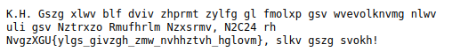
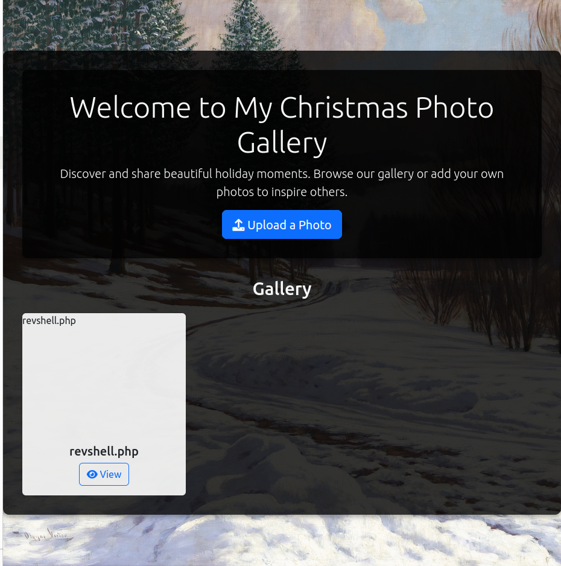
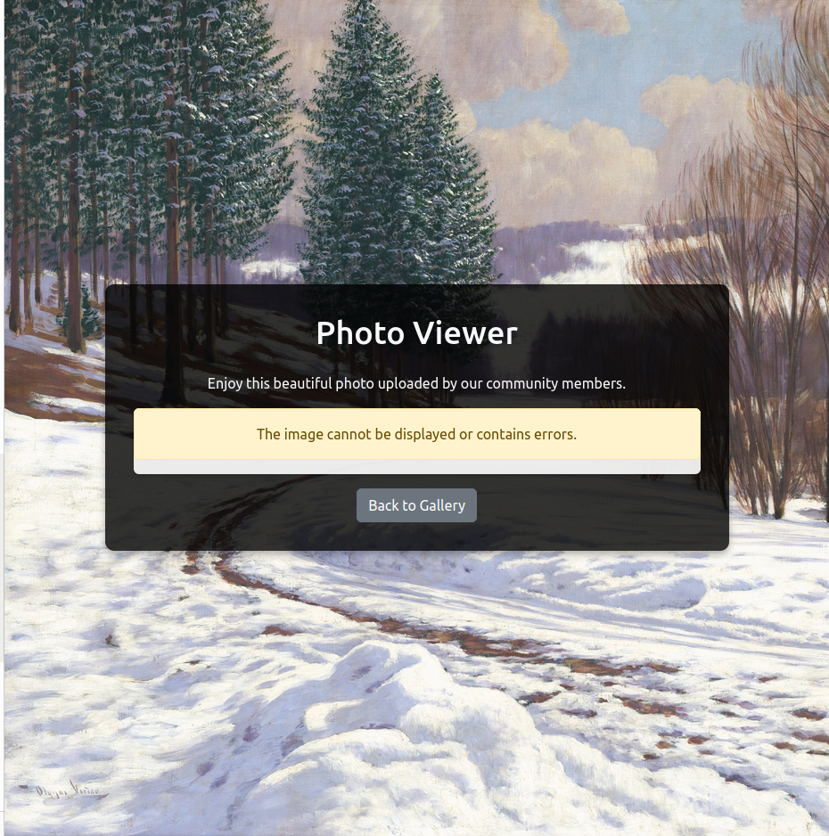
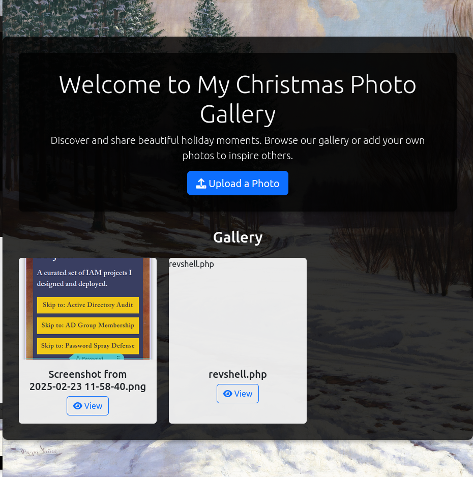
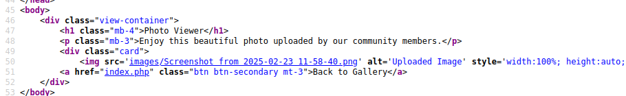
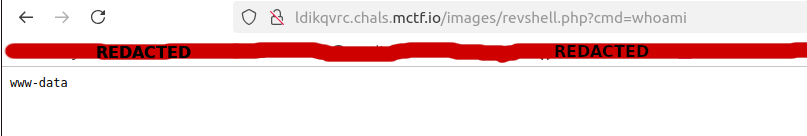
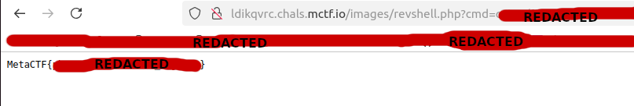

So, work has kept me very busy jumping neck-deep into some very hands-on IAM experiences lately, and I've been spending a majority of my evenings defragging and absorbing my lessons from the day. My main task being debugging a script that was provided by a Microsoft engineer that recently got reworked and remembering how satisfying it is to figure out the cause of unexpected program behavior. Plus, picking up primary admin duties on our cloud-based IAM solution has kept me on my toes. In any case, I've been looking forward to doing the walkthroug on this one because I found another unintended solution to one of the challenges for the month of December. I've decided I'm only going to do blurbs for the challenges I've solved. Which was only two of ten, but I still managed to score pretty well given the number of folks signed up. 178 of 1045 scoring participants, and 2805 registered. I did recently learn on LinkedIn that there are CISO's in the competition, which actually made me feel a lot better about my performance. Scoring was dynamic, and challenges weren't given in any particular difficulty order, which made prioritizing challenging, since it was harder to know if I should have known something or not. Plus, I was picking up my girlfriend from the airport later that day, so I may have been a little distracted. Anyway, on to the methodology.

1. The first problem I solved was a crypto challenge. This was a relatively simple and straightforward problem, but I've seen a few of these now. Casesar ciphers are a good first place to start, however, this was not the cipher used here. Something slightly more complex, and a good second step to check, is a substitution cipher, which is what this one ends up being. There are tools that will [automatically solve (if you're in a rush, or something)](https://planetcalc.com/8047/) either of these ciphers, but a good place to start for a substitution cipher is to swap out characters you are highly confident you can guess, seeing what the implications are, and building off of that. Thankfully, there are two places where we can reasonably guess the contents of this letter. The first is P.S., which is probably less commonly known these days, but there seems to be a P.S. section at the bottom of this letter. The second is the flag format spotted near the end; all MetaCTF flags follow the format "MetaCTF" followed by a, generally, alphanumeric string with possible underscores between squiggle brackets / curly braces. And in this case, it looks like we've got that in the final line of the letter. Doing some reasonable guessing and spelling in English ends up revealing the flag, and if you're so inclined, the whole message. 

    

2. The second problem I solved was a web exploit challenge. I think because I had finished the [October write up](https://github.com/PhoenixBoisnier/CTF-Walkthroughs/blob/main/MetaCTF-17-10-2024-Walktrhough/walkthrough.md) in December, I was primed to solve it the way I did. The "official" answer is to [deserialize the cookie](https://metactf.com/blog/flash-ctf-santas-digital-photo-library/) and was apparently one of the "write a script in less time than is ideal" problems. Deserialization can be a very serious security issue, and they tend to be challenging, without source code. Conveniently, the source code was provided, but I didn't look at it. 

    Whenever I see a file upload, I immediately see what kind of files I can put in it. Call it a grudge from one of the first CTFs I ever did where I didn't know what to do. So now that I know what to do, I do it. In this case, the upload accepts PHP files. 
    
    
    
    Cool. But where does it go? To find out, I went to view my file in the gallery, but it said there was an error displaying the image, which makes sense; it's not an image. 
    
    
    
    So, instead, I uploaded a valid image ([a screenshot of my personal website](https://pboisnie.wixsite.com/portfolio-page), at least, that's what I used while I was doing the write-up. Opportunity to advertise for myself.), which displayed, but didn't really give me any hints about the website's layout. At least, not on the surface. 
    
    
    
    There are two ways to find out where the image is stored, something I took advantage of once when trying to find a way to automate calls to a website I was using. Ask me about how my IP got blocked. It was kind of silly, but after reaching out to the admin, I was unblocked. More to the point, you can view the source code to see what path the files live on, and if they're renamed or anything, or you can right-click view image.
    
    
    
    
    
    This reveals to us the path we need, and more importantly, the files are not renamed. Since I'd uploaded a webshell, I decided to illustrate a payload using whoami.
    
    
    
    After a bit of poking around, I was able to find and read the flag.
    
    
    

I'd figured ten challenges would, hopefully, see myself getting more than two solves, but that didn't end up being the case. Compared to the others in the competition, I did fairly decently. But I'm doing better, on the whole, and I got to solve one of the web exploit challenges that wasn't part of the official methodology, which is pretty satisfying. I'd be curious to know how many people solved it this way versus the intended way. Conveniently, there is a conference this week ([BSides 2025](https://bsidesroc.com/)) where some of the operators of this challenge will be present, so maybe I'll ask. There's going to be a CTF, too, and I'm planning on participating. 
