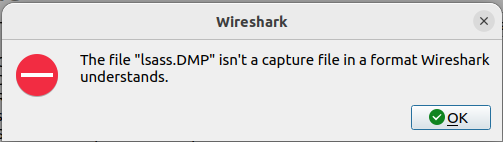

It's been a while since I've done a writeup for the MetaCTF challenges. There were a couple I didn't do so hot on, and one where I wasn't proud enough with how I did to do a writeup. To the point where [I did a different CTF and writeup](https://github.com/PhoenixBoisnier/CTF-Walkthroughs/blob/main/BruteIt-Walkthrough/BruteIt-Walkthrough.md) to show myself my prior successes weren't a fluke. And as important as I think it is to show some of the stumbling blocks, I don't think we need to see *all* of the stumbling blocks. In any case, for August's CTF, I was happy with my performance. I ended up scoring 30th overall of 311 scoring participants, and 878 total registered. I knew how to handle the problems I solved, and I had a good idea for the ones I didn't end up getting. I feel like I'm growing, which is ultimately why I wanted to display my journey. To show myself and others that it takes time to get to where I want to end up, and that I'm getting there. And now that I have stepped off of the soapbox, I will present my walkthrough for the 2024 August MetaCTF competition. 

1. For this event, I went pretty much in order of easiest to hardest. In this case, we're looking at a web exploitation problem. The website that was being hosted was pretty barren, with just a combination lock type interface. 


    While it's feasible that it could have been brute-forced, my experience with physical combination locks told me that wasn't the best option here. So, instead, I did what has been drilled into my head, and checked out the source code for any clues. I've only really ever seen that be worthwhile when that's explicitly what the lesson is, but without much else to go on, it was worth a shot. Turns out, it's worth checking for that low-hanging fruit, because someone decided to code the correct combination into a function in the source code. Nice.

    

    After fiddling with the UI, I managed to get the combination into the lock, press the button, and get the first flag. Off to a good start!

    

2. For the second challenge, we were presented with a link to some source code that was running on a remote server we could connect to using the provided command in the challenge. Looking at the code, I could tell it was C. Gross. (I'm not a fan of C. I like it better than Scala (Ask me about the time I got an error preventing compilation in MY COMMENTS with Scala...), but that doesn't mean I have to like C.) For those of you unfamiliar with C, the first line in the code starts pretty much every C program I've seen. Anyway, that could mean that there was some buffer overflow going on here, and I'd recently watched a video on how to test overflow bugs. So I was excited to see how much I'd retained. Not pictured is the vim command I used to copy / paste the source, but once I had it in a C file, I compiled it using gcc, specifiying the output file with -o. A gets() warning popped out, which means I'm probably right about the buffer overflow. Next, I made the output file executable with chmod. From there, it was time to run this bad boy and see what we had. 


      Wow, a memory examination visual aid. Honestly, that was a stroke of really good luck because I don't have a go-to tool for memory examination, and based on the video I'd seen, that's an important tool to use when going for an overflow. So it was time to test out the program, and see if I sort of knew what I was doing. I began with 'abcd' just to see which direction the memory would load from. I feel like if I was more familiar with little-endian versus big-endian, and where I can find each one, I probably could have skipped that step, but here we are. Looking at the source code, it tells us that we're in little-endian, but I wouldn't have known which one that was even if I'd seen it when I was solving this one. Just to make sure the memory layout was going to work the way I thought it was, I got the memory to wrap around after the 16th byte. Looks like the input was being fed into memory in [WYSIWYG](https://en.wikipedia.org/wiki/WYSIWYG) fashion. From here, it was time to craft the payload. Our goal was to cause the overflow while preserving the BIRD. 
      

      I've circled the important parts of my payload, and the representations in memory. Being versed in usability, I'm going to apologize for the poor color contrast in the image. I'm not great with GIMP yet. What I ended up circling are the last 9 bytes of my payload, and the last 8 bytes of the memory representation. You'll notice in the prior screenshot, that the BIRD was there the whole time, and we needed to make sure that when we got to that point in the input, it wasn't going to change that part of the memory. For this reason, we need to include BIRD in the payload such that BIRD will still exist at the same location in memory when we're done. Presumably, BIRD is where we start overflowing, and this can be confirmed by noting that the size of the array we're working with is 64 bytes long, which is why we need to take this step. Once we do that, all we need to do is overflow past BIRD. During the competition, I'd assumed we needed to overflow past the memory represented in the printout, but while playing with it for the writeup, all you need is one character past the BIRD. It doesn't even need to be a 1. But in other programs, that might make a difference, so beware. Connect to the remote server, run the payload, and you'll get the flag. Looks like this bird's egg is... *overflow-easy* B-)

3. This third one kind felt like one of those things you just kind of had to know. Or in my case, be reminded of by your choice of search engine / AI model. That being said, these LLMs aren't a magic pill (see below; challenge 4), and purely relying on them won't be the best way to learn. They're good for augmenting, and serve as a great way to remind yourself what you already know, but AI can have [Problems™](https://github.com/PhoenixBoisnier/CTF-Walkthroughs/blob/main/Gandalf-Challenge/Gandalf-Walkthrough.md). Maybe some day we'll see higher quality ML, but I hope that's a ways away. For Reasons™. Back on topic, though. Downloading the file for this challenge, we get a zip file of what is very likely to be an LSASS dump. After unzipping it, my flavor of Linux decided Wireshark would be the best program for the job, and I was foolish, and trusted my machine blindly. 

    

   With Wireshark out of the game, and in my defense, MetaCTF has had something with Wireshark every time I've participated, I turned to one of the free LLM models available publicly to ask what kind of programs can open a .DMP file. Based on the title of the challenge, I probably should have seen this coming, but Mimikatz is involved. Because I was doing the challenge on a Linux box, I ran:

```
pip install pypykatz
```

    to get a version that I could run on my Linux box. From there, it was just a matter of searching for which flags / arguments to use. LLMs, search engines, running help from the program itself. Any of those methods or a combination of those methods works to figure out how to use a CLI tool like this. 


After figuring out how to use the tool, you can run the proper command, and you get an output. A lot of output.


Since this is a MetaCTF competition, and all of the flags start with "MetaCTF{" you can GREP for that, and get the flag. I didn't do that during the competition because I thought it would be more fun to dig through who knows how many lines of output to find the needle in the haystack. Don't be like me, use GREP. 


4. Now, challenge number four was... a lot. The goal was to reverse 1024 iterations of an RSA encryption to get the plaintext. You were given the final ciphertext, and the 'n' where n = p * q for each RSA iteration. Now, I'm not bad at math, but I have to know the math, first. And then use it repeatedly so I don't forget the math. I never did a deep dive into crypto, and crypto is math. So, if you couldn't see where this is going, I decided to ask my LLM again for help with reversing the function. Something I failed to realize at the time was that the [getPrime function](https://pythonhosted.org/pycrypto/Crypto.Util.number-module.html#getPrime) doesn't return a consistent value given the same input. In retrospect, I think I should have realized that, but I had been operating under the assumption that it was a consistent function. With assumption in place, I started at a 1536 byte prime number, got the next one, and worked my way backwards, starting with the ciphertext as input, and performing the reverse process on the encryption, which involved [Euler's Totient](https://en.wikipedia.org/wiki/Euler%27s_totient_function#The_RSA_cryptosystem). Unfortunately, I was running that python script from my host machine, in a Python3 shell while simultaneously running my VM, and the script was not fast to execute. While it was running the first time, I looked at challenge five a bit (see below), but ultimately, I ran the clock out on this one. I was on the right track, but I don't know if I'd have known how to calculate p and q from n if I'd realized getPrime returned a random prime. It was a good learning experience, though. If I had been on a team, I think we'd have gotten this one. 

5. Challenge five was one I only touched on briefly between waiting for downloads or executions to finish for other challenges. This was the Reverse Engineering category for this month, and I usually end up doing a bit better on reverse engineering challenges, in general, than I expect to. My performance in other, content-disclosure-restricted-CTFs brought that to my attention when I was solving above the predicted bracket for my experience level. In any case, I spun up Ghidra, and starting poking around. It was a mess in there, and after sifting through, I ended up seeing something that I thought would be a good lead, a line that read "This file is packed with the UPX executable packer http://upx.sf.net". Cool, maybe there's a way to unpack it. And it looks like there is. I tried to run upx -d -o on the file, but ended up with an error telling me that the file was not packed with UPX. And since I was still working on challenge four, which seemed more tenable at the time, this is where I stopped. The published walkthrough mentions [an article](https://blogs.jpcert.or.jp/en/2022/03/anti_upx_unpack.html) that covers anti UPX unpacking techniques, which involves changing the magic numbers in the UPX packed files. It'd been a while since I've touched a magic number, and normally in the process of bypassing file uploads, so I don't know if I would have gotten there on this one, but I was glad that my initial thoughts were on the right track here. The solution for this challenge was pretty involved, but it does give me an alternative to Ghidra to look at eventually, Ida Free. Never a bad idea to have multiple tools for one job, which is why I've been working on the [Brute Force Heroes](https://tryhackme.com/r/room/bruteforceheroes) room on TryHackMe after [running my head into a wall with Hydra](https://github.com/PhoenixBoisnier/CTF-Walkthroughs/blob/main/BruteIt-Walkthrough/BruteIt-Walkthrough.md) in [Brute It](https://tryhackme.com/r/room/bruteit).

All in all, I'm learning. It's not as fast as I'd like, and it doesn't always feel like I'm progressing, but bit by bit (byte by byte?), I'm getting closer to where I want to be. 30 of 311 isn't bad, but I want to start scoring closer to my ranking on TryHackMe. I think it might be a little while before I hit in the top 2-3% on a CTF, but the only way to do that is to keep learning, and keep going after flags. 
