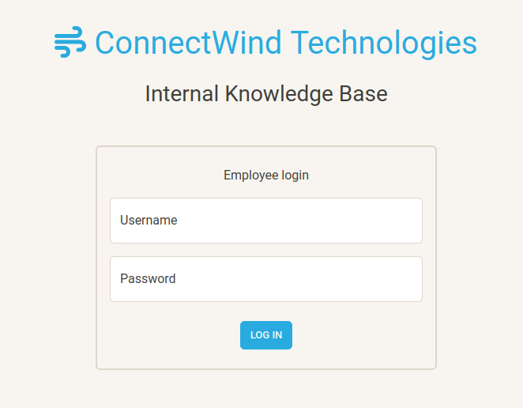
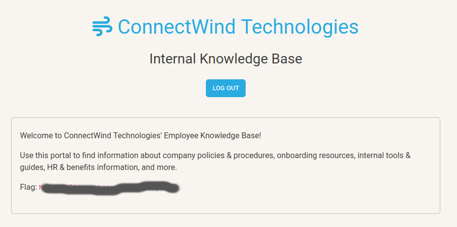

On April 26th, 2024 I competed in a CTF event hosted by MetaCTF (https://metactf.com/). This CTF was hosted online, and had a two hour time limit, beginning at 13:00 EDT. 

1. To warm up, and familiarize myself with the environment, I enrolled in a previously completed CTF that was made available to anyone with an account registered on MetaCTF's website (Please note, these challenges are only guaranteed to remain available for at least three months after being posted). The first challenge I looked at was the [Direct Login](https://metaproblems.com/71c5b42eb77639d5224be5589123de30/) challenge.


 
One of the first attacks I tried were some very basic credentials, guessing at common combinations. admin:admin, admin:password, etc. I tried a handful of combinations, none of which worked, but it was worth a shot. Rereading the problem description, I noticed that the goal was to be able to log in without knowing the password, so I was confident that it was not going to be something easily guessable at this point, since that would entail knowing the password. With that in mind, my next thought was to try SQLi, since this is a relatively common method through which an attacker can bypass a login screen. After trying a few different injections using different escape sequences, I decided I should look at the source code for the page. Toward the bottom of the page, I noticed there was a script that seemed to handle the login. 

```
function set_alert(txt, color) {
        var result = '<div class="alert mb-0 alert-' + color + '">' + txt + '</div>';
        $("#result").html(result);
        $("#result").fadeIn();
      }

      // Check if provided username and password are correct
      function login() {
        $("#result").fadeOut("fast");
        // Send request with credentials
        $.getJSON("login.php",
          {
            "action":"login",
            "username": $("#username").val(),
            "password": $("#password").val()
          }, function (r) {
            if (r.login_successful) {
              // Redirect if login successful
              set_alert('Login successful! Redirecting... <i class="fa-solid fa-spinner fa-spin"></i>', "success");
              setTimeout(function () {
                window.location.href = "./employee_portal.php";
              }, 1500);
            } else {
              // Username or password incorrect
              set_alert("Login failed! Please try again.", "danger");
            }
          }
        );
      }
```

Seeing that there was some logic to handle a successful login, my initial instinct was to see if I could intercept and modify the script using BurpSuite to change the value of the if statement to true. However, within the successful login section, I noticed that there was a relative URL that seemed like it might be a better way to access the page. I copied this portion of the link, and appended it to the URL from the landing page.



2. Feeling good after figuring out the trick, I was ready to move onto a second challenge. Obfuscated Secrets involved a Python script that would need to be reverse engineered to reveal the flag. Being somewhat strong with Python, and programming, this challenge was simple for me since the script was presented as its source code, which I have included below:

```
# METACTF FLAG CHECKER

# This program asks the user for a flag and responds with whether
#   the flag they entered is correct or incorrect.

# Receive input
entered_flag = input("Please enter the flag: ")

# Function to validate flags
def validate_flag(flag):
    # Some random string we need. The program doesn't seem to work without it ¯\_(ツ)_/¯
    encrypted = "Lcq]>N?s]bV[R[_OaScQ]]NGPYDKDNG]"
    # Check if length matches
    if len(flag) != len(encrypted): return False
    # Check if entered flag is correct
    return all([ord(flag[i]) - 1 == ord(encrypted[i]) + i for i in range(len(encrypted))])

# Print results
if validate_flag(entered_flag):
    print("Congrats! Your flag is correct.")
else:
    print("Sorry, your flag is incorrect. Please try again.")
    
```

With only a few lines, this script didn't require too much digging. One of the comments was a pretty good hint at what the ciphertext was. I wasn't sure what the ord() function did, so I had to look it up. The syntax of the return call wasn't something I was very familiar seeing done quite like that, but the overall idea was conveyed: we were looping over each of the characters in the ciphertext, and returning true if and only if all of the characters for the input text matched the cleartext string. I started a Python shell in my terminal and ran through a couple iterations of the ciphertext, character by character. At first, I was only evaluating the right half of the equation:

```
ord(encrypted[i]) + i
```

This was giving me results that were expected based on what I had looked up for ord(). It looked like the input was going to need to have an ASCII value of one less than the ciphertext's ASCII value at the same index. Realizing that algerbra would help here, and that if a function ord() existed, then there should be a reverse function for ord, which lead me to discover chr(). Armed with this new knowledge, I saved the value for the ciphertext, and wrote up a small script to calculate the flag:

```
encrypted = "Lcq]>N?s]bV[R[_OaScQ]]NGPYDKDNG]"
for i in range(len(encrypted)):
	print(chr(ord(encrypted[i])+i+1))

```

The output wasn't pretty, but it got the job done faster than it would have if I'd done them individually. By this point, the live CTF was about to start, and so I prepared myself for the challenges to come. 

3. When 13:00 came, I was excited and anxious, as this was my first live, timed CTF, and it had been a little while since I had engaged in technical exploitation (as opposed to social engineering techniques). I looked over the challenges, and read through each one, taking note of their point values, and which ones I believed I could solve quickly. Eventually, I settled for [Architecture Astronaut](https://metaproblems.com/d36b89698928224c03f29aa2d2cb5544/astronaut) as my first problem to solve. While I did remember that files often contain more metadata than the average end users knows, in the heat of the moment, I was blanking on one of the tools I knew would help me view this information. While fumbling around looking at the file in a text editor, I noticed that it was an elf file. This helped direct my search, and I was able to learn about a command-line tool that was already installed on my machine, readelf. 

```
readelf -h astronaut
```

revealed the Machine: information, which was the flag for this challenge. I submitted the information, and placed myself on the scoreboard.

4. Next up, I tried my hand at [Login Query](http://host5.metaproblems.com:7600/). The way the challenge was written made it sound like there was a good chance this exploit would involve SQLi. Luckily, I had prepared ahead of time, and had a reference book handy, along with my personal notes. SQLi was, until this challenge, something that I understood conceptually, but had never really put into execution. I'd been exposed to a number of automated tools, but I'd always struggled a little bit with figuring out exactly which sets of escape / comment sequences to use for a given SQL injection vulnerability. I aimed a few of the different sequences at the password field, but had no luck. There was a link to download the source code, but I decided to move onto a different challenge for now, and come back to this one later. I was being timed, after all, and the other challenged were worth more points. 

5. For the next challenge, Lost Luggage, we were given a password protected zip file, which can be found [HERE](https://metaproblems.com/d36b89698928224c03f29aa2d2cb5544/luggage.zip), as long as MetaCTF is still hosting the content. Luckily for me, I knew exactly what tool to use for this challenge. While most of the walkthroughs I've seen will reference Hashcat, or other cracking tools, I've always been more successful with John the Ripper. I don't know if Hashcat can crack password protected zips, but I know that JtR can, specifically with the Jumbo John version. This was something I had recently set up on one of my machines, so I was ready to go. After a quick call of 

```
zip2john luggage.zip > luggage.hashes
```

I was ready to set JtR to work. Knowing that the password was a simple, four-digit pin, I decided not to use the --wordlist flag, and instead let JtR brute-force the PIN. 

```
john luggage.hashes
```

returned the pin. Getting a little excited, I entered the PIN as the flag. Whoops! After running 

```
unzip luggage.zip
```

and entering the PIN, the flag.txt file popped out, and a quick cat granted the flag. 

6. Having completed my second challenge, I turned back to [Login Query](http://host5.metaproblems.com:7600/). This time, I decided to open the source code. It was in a zip folder, but the code was more Python. Nice. 

```
from flask import Flask, request, render_template
import random
import os
import sqlite3
import hashlib

os.chdir(os.path.dirname(os.path.realpath(__file__)))

db = sqlite3.connect("db.sqlite", check_same_thread=False)
db_cursor = db.cursor()

app = Flask(__name__)

@app.route('/', methods=['GET', 'POST'])
@app.route('/index.html', methods=['GET', 'POST'])
def index():
    return render_template("index.html")

@app.route('/login', methods=['POST'])
def login():
    data = request.json
    username = data.get("username", "-")
    password_hash = hashlib.md5(data.get("password", "-").encode()).hexdigest()

    db_error = ""
    try:
        query = "SELECT username, public_btc_address, private_btc_key, balance FROM users WHERE username='" + username + "' AND password_hash='" + password_hash + "';"
        result = db_cursor.execute(query)
        user_data = result.fetchone()
    except Exception as e:
        user_data = None
        db_error = str(e)

    if user_data is None:
        return {
            "error": True,
            "message": "Login failed. Please try again.",
            "debug": query,
            "debug_msg": db_error,
        }
    else:
        return {
            "error": False,
            "message": "Login successful.",
            "username": user_data[0],
            "public_btc_address": user_data[1],
            "private_btc_key": user_data[2],
            "balance": user_data[3]
        }

app.run(debug=True, host="0.0.0.0")
```

A little bigger, and with a few more function calls I was unfamiliar with, but between context and DuckDuckGo, I was starting to piece together more of the puzzle. Having been fresh off of my warmup challenge, I decided to try the injection using URL arguments, aimed at the /login page. This resulted in an error page, but not the kind you want when enumerating SQLi vulnerabilities. Eventually, after looking at the source code more, I saw that the password field was being encoded, then transformed by an MD5 hash function, before finally being turned into a hexdigest. Was I really supposed to figure out a hash collision for this? Work backwards and find an input that would allow for injection into the password field? Surely not, but still under pressure, it was all I could come up with at the time. So instead I moved on to another challenge, determined to come back and finish this one, next.

7. The next challenge I completed was Obnoxious Effort, which involved an IMG disk file, which can be found [HERE](https://metaproblems.com/d36b89698928224c03f29aa2d2cb5544/obnoxious.img), as long as MetaCTF is still hosting the file. Mounting drives via the terminal is something I have done before, but it had been some time, and I wrestled with the terminal for a few minutes before realizing that I didn't have to be Hackerman here. I could just use the GUI. So I did. Mounting the drive this way was far easier, and let me view the file system quickly. Two partitions were present. One only contained teasing comments about a lack of flags, while the other one had a very deep set of nested folders, with single characters for the names of each of the directories. Pretty quickly, as I opened more of the folders, I noticed that the filepath at the top of the navigator was beginning to spell out the beginning of MetaCTF's flag syntax. I followed the structure to its end, and was able to claim my third victory. 

8. Not wanting to do reverse engineering just yet with the challenge Internet Talk, I opted to return to [Login Query](http://host5.metaproblems.com:7600/). The wording of the challenge certainly was pointing us to perform SQLi, and after the last few challenges, I was beginning to believe that we were not being lead astray. I took once more to the source code, and looked over the query one last time, determined to figure out the solution. 

```
query = "SELECT username, public_btc_address, private_btc_key, balance FROM users WHERE username='" + username + "' AND password_hash='" + password_hash + "';"
```

I knew I would need to use ', and that I would also likely need to make use of the ;-- sequence. Which was when it hit me. Why bother with the password at all when I could just terminate the query early? Being armed with the username already, I injected my SQL into the username field, and bypassed the need to evaluate the password entirely. The password could be arbitrary at this point, and was. 


------------------------------------------------------------------------------------------------------


Getting this to work was very exciting and rewarding for me, and I would consider it the highlight of the CTF, for me, personally. This was the first SQLi I'd managed to work my way through without any sort of outside guidance. And on top of that, I was under a time constraint. With four of five challenges completed, there was only one left to tackle...

9. Internet Talk provided an executable file, which can be obtained [HERE](https://metaproblems.com/3a748d8f30934d364f879117010fcbe4/leet), as long as MetaCTF is still hosting the file. Having completed a series of reverse engineering challenges on my current training platform, TryHackMe, I went into this challenge feeling confident, still high on my four wins from the past hour. I didn't have Ghidra already installed on my machine, so I downloaded it, and went to picking apart the code. While I waited, I began to poke at the application using the command MetaCTF provided:

```
nc host5.metaproblems.com 5040
```

True to its name, it did, in fact, convert input into l33t. I noticed that there was also some output after the interaction terminated, that were neither non-standard A-Za-z0-9 characters, nor special characters that one could access without knowing alt-key combinations. Longer inputs seemed to eliminate them, and different inputs would cause different versions of it to be printed to the console. With Ghidra finally loaded up, I was able to start looking at the source code. It was C. Not nice. I understand enough C to follow along for the most part, but I'm not a fan. More a fan of C than Scala, but only because I managed to get Scala to throw a compiler error on a comment, and could only fix it by deleting all of my code. But I digress. Sifting through the code, I noticed that it loaded the flag.txt file in one of the functions, and that it appeared to have variables sequentially in the code. Maybe this was supposed to be some sort of buffer overflow? I jumped from funtion to function, trying to find more hints, and see how the input to this program could travel to this part of the code and present the flag. I decided to feed the program more input to see if I could determine a pattern, or find any sort of input that would be helpful, but did not succeed. GCC was an option, and is a tool that I have used before, but it was not on my mind at this time. I figured if I could find some sort of input that gave insight into the output, other than being a l33t sp34k translator, that maybe that would show me where to go with the code. Ultimately, I ended up spinning my wheels on this last challenge for the last hour. It was the most highly point-valued challenge in this CTF, so I don't feel too bad about missing it. Of the 922 of us who were signed up for the event, only 10 managed to get the solution for this challenge. Sometime, in the near future, we can add +1 to that number, but I'm still learning. And I won't stop learning. 

I ended up placing 66th out of 922 enrolled participants, of which, 300 of us scored. I did a lot better than I was worried that I might, and I'm happy to see growth in my skills. It was a good way to show myself that I know more than I give myself credit for, and I'm proud to have performed the way I did. When MetaCTF released their walkthroughs for each challenge, it looked like they used a toolset and methodology that I had never heard of before, so I really can't be too hard on myself. The only thing to do now is look it up, and do more research. 
